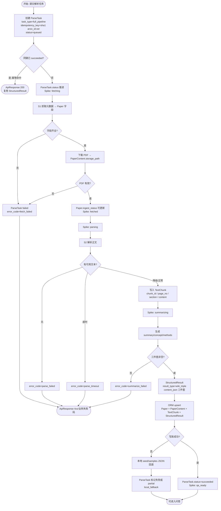
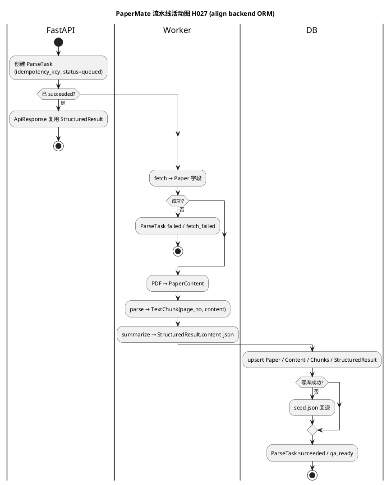

# 处理流水线活动图（H027）

| 项 | 内容 |
|----|------|
| 任务 | **H027** · 抓取→下载→解析→切分→摘要→入库 |
| 版本 | **V1.1** · 2026-07-16（对齐 `SE26Project-04/backend` ORM） |
| 状态约定 | Spike 流水线状态见 `docs/spike/技术Spike清单.md`；任务表用 `ParseTask` |
| Backend | `backend/app/model/entities.py` |
| 渲染 | https://mermaid.live |

---

## 0. Backend 实体对照（修订依据）

| 流水线概念 | ORM / 表 | 关键字段 |
|------------|----------|----------|
| 论文元数据 | `Paper` / `papers` | `arxiv_id`, `title`, `abstract`, `published_at`, `primary_category`, `pdf_url`, `source_url`, `ingest_status` |
| 作者 | `Author` + `PaperAuthor` | `normalized_name`, `author_order` |
| PDF 落盘 | `PaperContent` / `paper_contents` | `storage_path`, `checksum`, `mime_type` |
| 处理任务 | **`ParseTask`** / `parse_tasks` | `task_type`, `status`(默认 `queued`), `attempt`, `idempotency_key`, `error_code` |
| Wiki 三件套 | `StructuredResult` / `structured_results` | `result_type`, `version`, `content_json`, `source_locator` |
| 切块 | **`TextChunk`** / `text_chunks` | `chunk_id`, **`page_no`**, `section`, **`content`**, `embedding` |
| API 信封 | `ApiResponse` | `code`, `message`, `data`, `request_id` |

> 当前 backend 仅实现 `GET /health`；下图「入库」步以 ORM 写入为目标契约，路由待 C 的 H045+。

**ParseTask.status（建议映射）**：`queued` → Spike 的 `pending`；执行中写 Spike 阶段名或细分子状态；终态 `succeeded` / `failed`（`error_code` 填 `fetch_failed` 等）。

---

## 1. 活动图（含分支与失败旁路）

---

## 2. 逐步输入 / 输出（验收核心）

| 步骤 | 输入 | 输出（对齐 ORM） | 超时 | 失败 |
|------|------|------------------|------|------|
| 创建 ParseTask | `arxiv_id`, `pipeline_ver` | `parse_tasks` 行；`idempotency_key` | — | 幂等命中返回已有结果 |
| S1 元数据 | arXiv ID | `Paper` 行字段（见 §0） | ≤10s | `error_code=fetch_failed` |
| 下载 PDF | `pdf_url` | `PaperContent.storage_path` | ≤60s（长文 ≤120s） | `fetch_failed` |
| S2 解析 | PDF 路径 | 段落流（内存） | ≤90s（长文 ≤180s） | `parse_failed` / `parse_timeout` |
| 切分 | 段落 | `TextChunk`（`page_no`/`content`） | ≤30s | 无 chunk → QA 拒答 |
| S3 摘要 | chunks + Paper | `StructuredResult.content_json` | ≤60s | `summarize_failed` |
| 入库 | 上述实体 | DB 或 `seed.json` 回退 | ≤10s | `local_fallback` |
| 可问答 | succeeded | Spike `qa_ready` | — | P9/P10 禁止成功入库 |

---

## 3. PlantUML 备选

---

## 4. 与 H017–H018 / backend 对照

| Spike 步 | 活动图 | Backend |
|----------|--------|---------|
| fetch_metadata | → Paper | ORM 已有表；写 API 待定 |
| download_pdf | → PaperContent | ORM 已有表 |
| parse_pdf | → TextChunk | 字段名 `page_no`/`content` |
| summarize | → StructuredResult | `content_json` 三件套 |
| — | ParseTask | `parse_tasks`；非泛型 Task |
