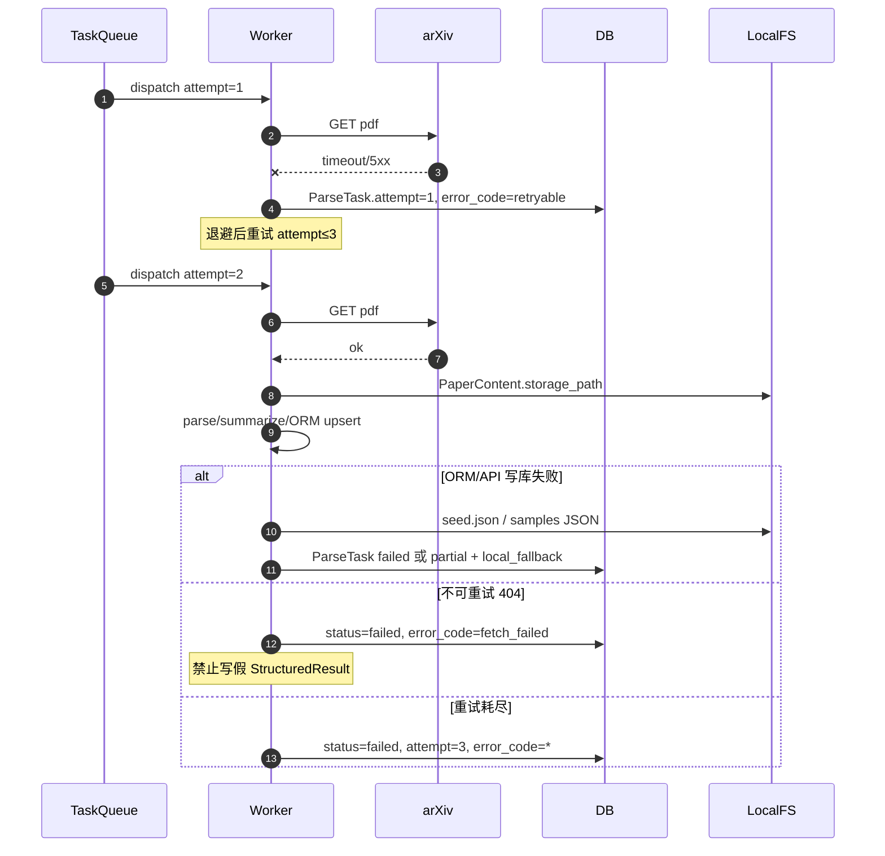
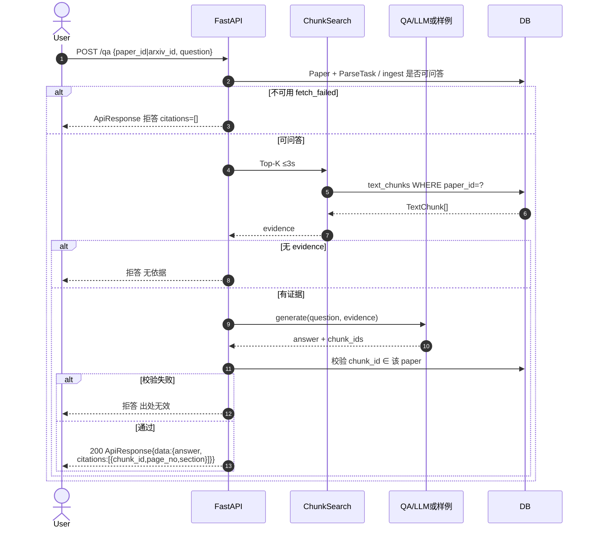
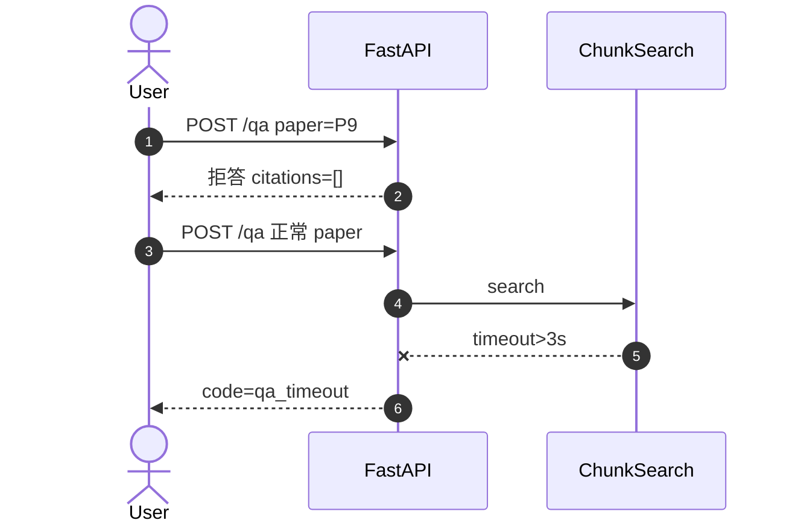
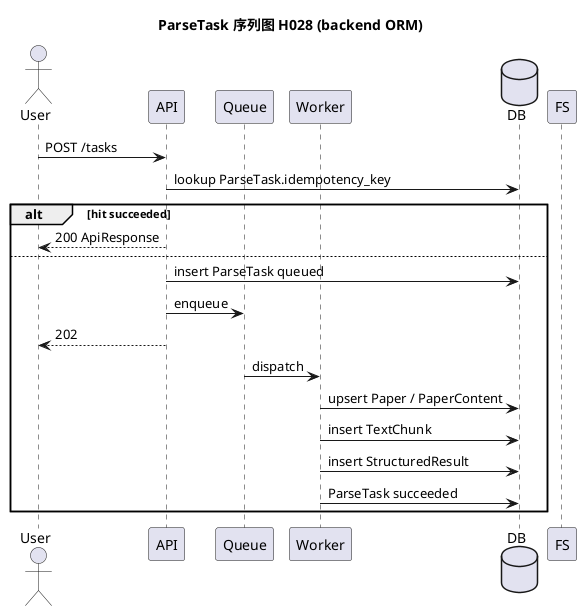

# 处理任务与问答序列图（H028）

| 项 | 内容 |
|----|------|
| 任务 | **H028** · ParseTask 序列图 + 问答序列图 |
| 版本 | **V1.1** · 2026-07-16（对齐 `SE26Project-04/backend`） |
| 配套 | [pipeline-activity.md](./pipeline-activity.md) |
| 渲染 | https://mermaid.live |

---

## 0. Backend 对齐摘要

| 约定 | 值 |
|------|-----|
| 任务实体 | **`ParseTask`**（表 `parse_tasks`），不是泛型 Task |
| 切块实体 | **`TextChunk`**：`chunk_id`, `page_no`, `section`, `content` |
| 结构化结果 | **`StructuredResult`**：`result_type=wiki_triple`, `content_json`, `source_locator` |
| 响应信封 | `ApiResponse{code,message,data,request_id}` |
| 已实现路由 | 仅 `GET /health`（H015/H016） |
| 目标路由（待 C） | `POST /tasks`（或 `/parse-tasks`）、写库、`POST /search/chunks`、`POST /qa` |

---

## 1. 处理任务序列图

### 1.1 约定参数

| 项 | 约定值 |
|----|--------|
| 幂等键 | `ParseTask.idempotency_key = sha1(arxiv_id + ":" + pipeline_ver)[:…]` |
| 最大重试 | **3**（`ParseTask.attempt`） |
| 退避 | 1s → 2s → 4s |
| 阶段超时 | 元数据 10s / PDF 60s / 解析 90s / 摘要 60s |
| 不可重试 | 404、`fetch_failed`（P9/P10） |
| 样例回退 | 写库失败 → `data/seed.json` / `data/samples/<id>.json` |

### 1.2 正常路径

```mermaid
sequenceDiagram
  autonumber
  actor User
  participant API as FastAPI
  participant Q as TaskQueue
  participant W as Worker
  participant Arxiv as arXiv
  participant DB as SQLite/PG
  participant FS as LocalFS

  User->>API: POST /tasks {arxiv_id, pipeline_ver}
  Note over API: 目标契约；当前仅 GET /health 已实现
  API->>API: idempotency_key
  API->>DB: SELECT parse_tasks WHERE idempotency_key=?
  alt 已 succeeded
    DB-->>API: StructuredResult
    API-->>User: 200 ApiResponse{data: result}
  else 新建
    API->>DB: INSERT papers(可选) + parse_tasks(status=queued, attempt=1)
    API->>Q: enqueue(parse_task_id)
    API-->>User: 202 ApiResponse{data:{task_id}}
    Q->>W: dispatch(parse_task_id)

    W->>DB: ParseTask started_at; Spike fetching
    W->>Arxiv: GET meta ≤10s
    Arxiv-->>W: meta
    W->>DB: UPSERT Paper (arxiv_id, title, abstract,<br/>published_at, primary_category, pdf_url, source_url)
    W->>Arxiv: GET pdf ≤60s
    Arxiv-->>W: bytes
    W->>FS: storage_path
    W->>DB: UPSERT PaperContent(storage_path, mime_type, checksum)

    W->>DB: Spike parsing
    W->>W: parse + chunk ≤90s
    W->>DB: INSERT TextChunk(chunk_id, page_no, section, content)

    W->>DB: Spike summarizing
    W->>W: wiki triple ≤60s
    W->>DB: INSERT StructuredResult(result_type=wiki_triple,<br/>content_json, source_locator, version)

    W->>DB: ParseTask.status=succeeded, finished_at
    Note over W,DB: Paper.ingest_status 可升为 parsed/qa_ready
  end
```

### 1.3 重试与失败回退



---

## 2. 问答序列图

### 2.1 约定

| 项 | 值 |
|----|-----|
| RAG | ≤3s |
| 端到端 | ≤30s |
| Top-K | 5 |
| 引用 | 必须存在的 `TextChunk.chunk_id`（校验 `paper_id`） |
| 拒答 | 无依据 / 校验失败 → **禁止假引用** |
| 无 Key | 样例 JSON + 仍做 chunk 存在性校验 |

### 2.2 正常问答



### 2.3 失败样例 / 超时



---

## 3. PlantUML 备选（ParseTask）



---

## 4. H028 DoD

| 场景 | 覆盖 |
|------|------|
| 正常至 ParseTask succeeded + StructuredResult | ✅ §1.2 |
| 重试 attempt≤3 + 退避 | ✅ §1.3 |
| 写库失败 → seed 回退 | ✅ §1.3 |
| 幂等键 | ✅ |
| 问答引用 `chunk_id`/`page_no` 校验 | ✅ §2.2 |
| P9/P10 拒答 | ✅ §2.3 |
| 字段名对齐 backend ORM | ✅ V1.1 |
