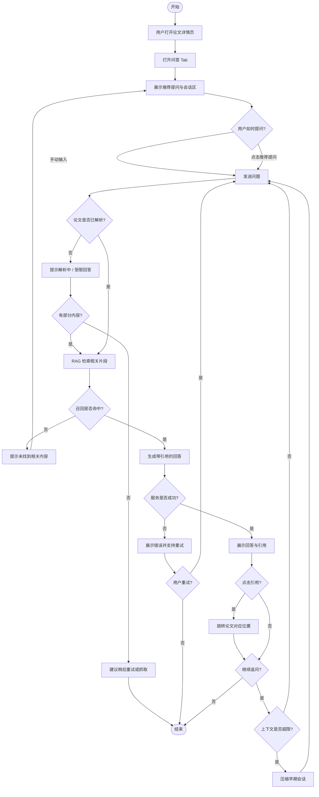

用例规约：智能问答（UC-P03）

项目 PaperMate 论文阅读与学习平台
用例编号 UC-P03
用例名称 智能问答
版本 1.0
日期 2026-07-10
作者 SE26Project-04

1. 简要说明

研究型用户在论文详情页围绕当前正在阅读的论文，通过右侧固定侧边栏发起自然语言提问。系统基于该论文的结构化内容与原文片段进行检索增强（RAG），生成带引用出处的回答，并支持多轮追问。该用例区别于「一键智能总结」等固定快捷指令，强调自由对话与证据可追溯。

2. 参与者

| 参与者 | 类型 | 说明 |
|--------|------|------|
| 研究型用户 | 主要参与者 | 已登录，正在阅读某篇论文，希望深入理解方法、实验或概念 |
| 论文阅读用户 | 主要参与者（泛化） | 与研究型用户同一角色，本用例对全部登录用户开放 |
| 问答 Agent | 次要参与者（系统） | 负责检索片段、组织上下文、调用生成服务并返回引用 |
| 阅读 Agent / 解析服务 | 次要参与者（系统） | 提供论文结构化内容与可检索片段；被 `<<include>>` 包含 |

3. 前置条件

| 编号 | 条件 |
|------|------|
| PRE-1 | 用户已成功登录系统。 |
| PRE-2 | 用户已进入某篇论文的详情页（用例 **UC-P02 查看论文详情** 已完成或正在进行）。 |
| PRE-3 | 目标论文已在系统中存在基本元数据（标题、标识等）；若尚未完成全文解析，系统应能展示解析状态（见备选流 A2）。 |
| PRE-4 | 问答 Agent 及检索索引服务处于可用状态（异常时走备选流 A4）。 |

 4. 后置条件

 4.1 成功后置条件

| 编号 | 条件 |
|------|------|
| POST-S1 | 系统在本轮会话中保存用户提问与系统回答（至少保留于当前页面会话；持久化策略由产品配置决定）。 |
| POST-S2 | 回答中展示的引用出处与用户可见的论文章节/片段保持一致。 |
| POST-S3 | 用户可继续在同一论文上下文中发起多轮追问，或切换至侧边栏其他 Tab 而不丢失当前会话（直至离开详情页或主动清空）。 |

 4.2 失败后置条件

| 编号 | 条件 |
|------|------|
| POST-F1 | 若检索或生成失败，系统向用户给出明确提示，**不**伪造引用出处。 |
| POST-F2 | 失败不导致论文详情其他区域（原文、结构化内容等）不可用。 |
| POST-F3 | 系统记录错误日志供管理员在 **UC-A04 查看异常日志** 中排查（若已实现审计）。 |

 5. 触发条件

用户在论文详情页右侧侧边栏选择 **「问答」** Tab；或
用户在 **「全部」** 汇总面板中点击「问答」相关卡片，系统自动展开问答 Tab（与原型交互一致）。

 6. 基本流（Main Success Scenario）

步骤| 参与者动作 | 系统响应 |
 1  | 用户打开论文详情页。 | 系统加载论文元数据、结构化内容区与右侧侧边栏；默认或用户切换到「问答」Tab。 |
 2  | — | 系统展示问答会话区：欢迎提示、推荐提问列表（如「核心创新是什么？」「实验设置如何？」）、多轮对话输入框。 |
 3  | 用户在输入框中输入与自然语言相关的问题，并发送。 | 系统接收问题，将会话上下文限定为当前论文；`<<include>>` 解析论文内容 所产出的可检索片段与结构化字段。 |
 4  | — | 系统执行 RAG 检索：从该论文的 summary / concept / methods 及原文片段中召回与问题相关的段落，响应时间目标 ≤ 3 秒（不含 LLM 生成耗时）。 |
 5  | — | 系统基于召回片段生成回答，并在回答中标注引用出处（如章节名、段落标识或结构化块名称）。 |
 6  | — | 系统在对话区追加一条系统消息，展示回答与可点击/可识别的引用列表。 |
 7  | 用户阅读回答；可选点击某条引用。 | 系统高亮或跳转至论文主体/结构化内容中的对应位置（与 **UC-P02** 联动）。 |
 8  | 用户继续输入追问（如「与 BERT 相比有何不同？」）。 | 系统携带本会话历史与同一论文上下文，重复步骤 4–6，更新对话区。 |
 9  | 用户结束问答（切换 Tab、返回工作空间或关闭页面）。 | 系统结束当前交互；若已实现持久化，则保存会话摘要供学习空间查阅。 |

基本流结束。

7. 备选流（Alternative Flows）

 备选流 A1：使用推荐提问

| 步骤 | 说明 |
|------|------|
| A1-1 | 在基本流步骤 2 之后，用户**不手动输入**，而是点击推荐提问列表中的某一项。 |
| A1-2 | 系统将该项文本视为用户提问，**并入基本流步骤 4**。 |

 备选流 A2：论文尚未完成解析

| 步骤 | 说明 |
|------|------|
| A2-1 | 在基本流步骤 3 或 4，系统检测到该论文解析状态为「解析中」或「未解析」。 |
| A2-2 | 系统在对话区提示：「该论文仍在解析中，当前仅可基于已有摘要/元数据回答，完整 RAG 能力将在解析完成后可用。」 |
| A2-3 | 若已有 summary 等部分结构化内容，系统尝试基于**已有片段**执行受限检索并返回答案，引用处标注「基于部分解析结果」。 |
| A2-4 | 若尚无任何可检索内容，系统建议用户稍后重试或触发 **UC-W04 手动触发抓取论文**；用例结束或等待用户重试。 |

 备选流 A3：检索无相关片段

| 步骤 | 说明 |
|------|------|
| A3-1 | 在基本流步骤 4，RAG 召回得分为空或低于阈值。 |
| A3-2 | 系统返回说明性回答：「未在当前论文中找到与您问题直接相关的内容」，并建议用户换用论文中的术语、选择推荐提问，或到「信息 / Wiki」Tab 检索关联概念。 |
| A3-3 | 用例返回基本流步骤 2，等待用户重新提问。 |

 备选流 A4：问答服务超时或不可用

| 步骤 | 说明 |
|------|------|
| A4-1 | 在基本流步骤 4 或 5，检索服务或生成服务超时、限流或返回错误。 |
| A4-2 | 系统在对话区展示错误提示（如「问答服务暂时不可用，请稍后重试」），并提供**重试**操作。 |
| A4-3 | 用户选择重试则回到基本流步骤 3；放弃则用例结束，后置条件满足 POST-F1、POST-F2。 |

 备选流 A5：多轮会话上下文过长

| 步骤 | 说明 |
|------|------|
| A5-1 | 在基本流步骤 8，系统检测到会话轮次或 token 长度超过策略上限。 |
| A5-2 | 系统自动对较早轮次做摘要压缩，保留最近若干轮完整对话与当前论文标识。 |
| A5-3 | 系统可选提示用户：「对话较长，已自动压缩早期上下文。」随后继续基本流步骤 4–6。 |

 备选流 A6：用户切换阅读模式

| 步骤 | 说明 |
|------|------|
| A6-1 | 在会话进行中，用户通过顶栏/设置切换阅读模式（新手 / 研究 / 工程等，**UC-P09 切换阅读模式**）。 |
| A6-2 | 系统保留当前问答会话与论文上下文不变；后续新生成的回答可按新模式调整表述风格（业务策略可选）。 |
| A6-3 | 返回基本流步骤 8 或等待下一次提问。 |

 8. 特殊需求

| 编号 | 需求 |
|------|------|
| SR-1 | 回答必须尽量附带**可核验的引用出处**，避免无依据的幻觉性陈述。 |
| SR-2 | RAG 检索阶段响应时间目标 **≤ 3 秒**（不含 LLM 生成时间）。 |
| SR-3 | 问答上下文**Scoped to 当前论文**，不得默认混入其他论文内容（除非用户显式在问题中要求对比，此时可 `<<extend>>` 对比阅读能力）。 |
| SR-4 | 侧边栏应支持与其他 Tab（信息、辅助阅读、笔记、对比）并行，不因问答阻塞原文阅读。 |

---

## 9. 相关用例

| 关系 | 用例 | 说明 |
|------|------|------|
| `<<include>>` | 解析论文内容 | 问答依赖可检索的论文片段与结构化内容 |
| 前置 | UC-P02 查看论文详情 | 用户须进入详情页 |
| 扩展场景 | UC-P08 进行论文对比阅读 | 用户追问涉及多篇论文对比时可能扩展 |
| 相关 | UC-W01 论文检索 | 用户常从工作空间检索后进入详情再问答 |

---

## 10. 界面与数据要点（与原型对应）

| 元素 | 说明 |
|------|------|
| 入口 | 论文详情页 → 右侧侧边栏 → **问答** Tab（`/paper/:paperId`） |
| 输入 | 多轮对话输入框（`ChatBox`） |
| 输出 | 对话消息列表；回答中含摘要式文本 + 引用出处 |
| 推荐提问 | 首次进入时可展示常见问题快捷按钮（目标系统能力，原型为占位） |

---

## 11. 活动图

---

## 12. 验收要点（摘要）

1. 登录用户可在任意已入库论文详情页发起至少一轮问答并看到系统回复。  
2. 成功回复中包含与论文内容一致的引用信息（或明确声明基于部分/缺失解析）。  
3. 解析中、检索无结果、服务失败三类场景均有清晰备选行为，且不展示虚假引用。  
4. 支持在同一论文下连续多轮追问，会话在侧边栏内连贯展示。

---

## 13. 备注

- 本规约描述**目标系统**行为，与当前界面原型中基于 Mock 的即时回复在实现深度上存在差异；原型已覆盖 Tab 入口、对话 UI 与多轮消息展示等交互骨架。  
- 用例追踪表中本项处理状态为「未开始」，本规约可作为迭代二及后端接入阶段的实现与测试依据。
