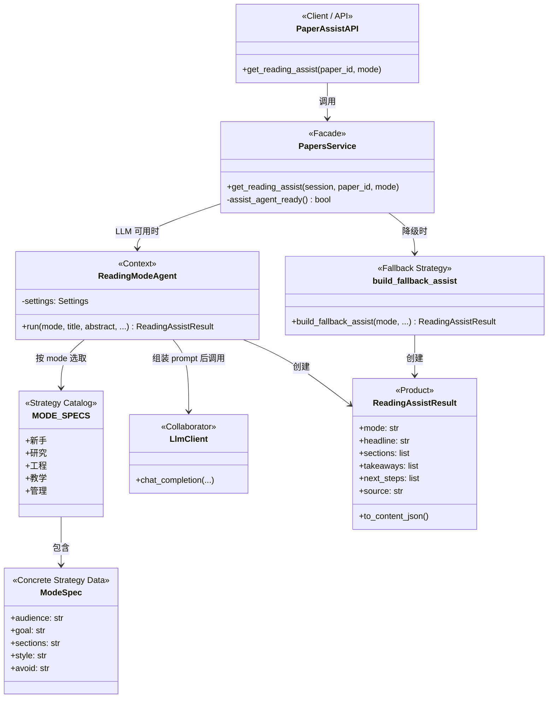
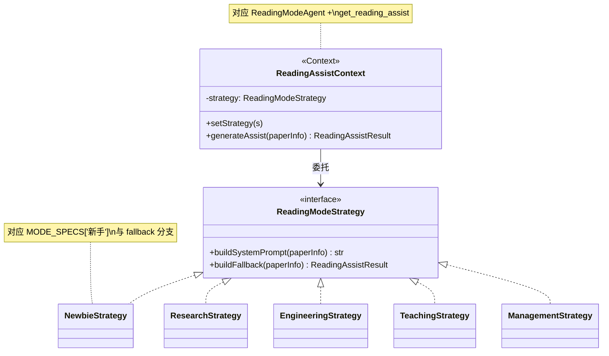
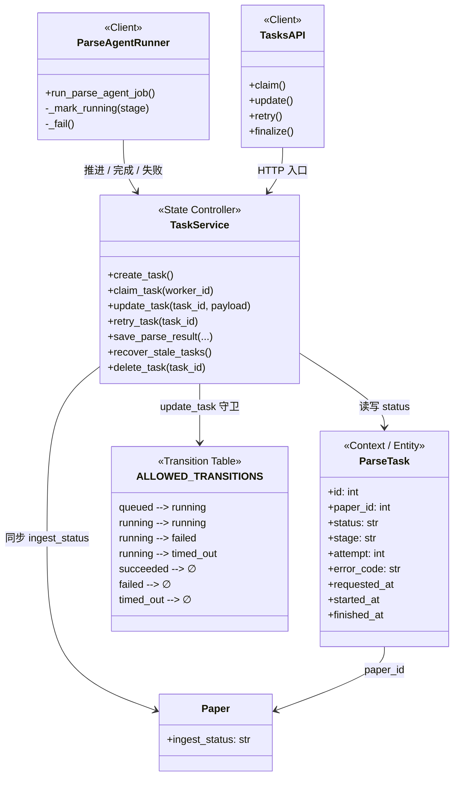
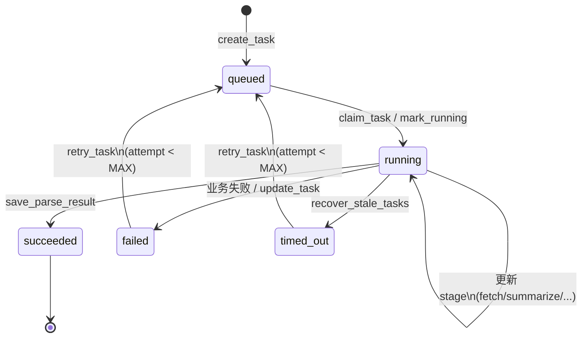
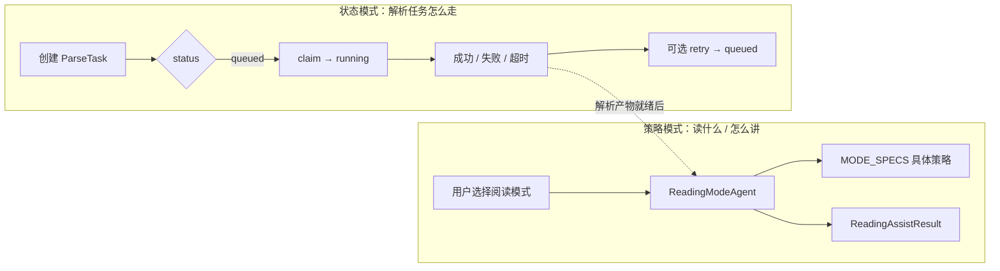

# PaperMate 详细设计：GoF 设计模式

> 文档目的：对大作业系统进行面向设计模式的详细设计说明。  
> 选取系统中**真实落地**、可对照源码核验的两种 GoF 模式：**策略模式（Strategy）** 与 **状态模式（State）**。  
> 配套文档：[`架构落地说明.md`](./架构落地说明.md)、[`2026-07-16-backend-architecture.md`](./2026-07-16-backend-architecture.md)。

---

## 1. 概述

PaperMate 是面向 arXiv 科研阅读的智能辅助系统，后端以 FastAPI + Agent 流水线组织能力，前端以 React 承载阅读与管理界面。在可扩展性与可维护性方面，系统刻意用设计模式约束关键行为的变化点：

| 变化点 | 采用模式 | 设计意图 |
|--------|----------|----------|
| 同一篇论文，不同读者画像需要不同的辅助阅读算法 | **策略模式** | 算法可替换，调用方接口稳定 |
| 论文解析任务生命周期（排队→执行→成功/失败→重试） | **状态模式** | 合法迁移集中管理，避免随意改状态 |

下文分别给出：**问题背景 → 模式映射 → UML 类图 → 协作说明 → 源码落点 → 收益**。

---

## 2. 策略模式（Strategy）：多模式辅助阅读

### 2.1 问题与意图

论文详情页提供「新手 / 研究 / 工程 / 教学 / 管理」五种阅读模式。五种模式的**输入相同**（标题、摘要、概念、方法等），**输出结构相同**（`headline`、`sections`、`takeaways`、`next_steps`），但**内容生成策略不同**（受众、目标、章节结构、文风与禁忌）。

若用大量 `if-else` 把五种提示词与降级模板写死在服务层，后续新增模式或调整某一模式会牵动整条调用链。策略模式把「怎么生成」从「何时生成」中分离出来。

**GoF 意图（对照）**：定义一系列算法，把它们封装起来并使它们可以互相替换；算法的变化独立于使用算法的客户。

### 2.2 参与者映射

| GoF 角色 | PaperMate 中的对应 | 说明 |
|----------|-------------------|------|
| **Context（上下文）** | `ReadingModeAgent` / `get_reading_assist` | 持有当前模式，对外提供统一 `run(mode, …)` / 服务入口 |
| **Strategy（策略接口）** | 「按模式生成 `ReadingAssistResult`」这一约定 | 实现上由 `MODE_SPECS` 条目 + 统一输出协议表达（数据驱动策略） |
| **ConcreteStrategy** | `MODE_SPECS["新手"\|"研究"\|"工程"\|"教学"\|"管理"]` | 各模式的 audience / goal / sections / style / avoid |
| **ConcreteStrategy（降级）** | `build_fallback_assist(mode, …)` 中各模式启发式模板 | LLM 不可用时的可替换算法，输出形状不变 |
| **Client** | 前端阅读辅助面板 → `GET/POST /api/papers/{id}/assist` | 只传 `mode`，不关心内部用 LLM 还是启发式 |

> 说明：当前实现是**数据驱动的策略表**（字典 + 统一执行器），而非五个 Strategy 子类。这在工程上更轻量，语义上等价于策略模式；若课程要求「经典类继承版 UML」，可将每个 `MODE_SPECS` 条目视为一个 `XxxModeStrategy` 具体策略类（见 2.3 右图）。

### 2.3 UML 类图

#### 图 A：与当前代码一致的结构（推荐答辩对照源码）

#### 图 B：经典 GoF 继承视角（便于课程报告理解）

### 2.4 协作过程（文字阐述）

1. **选择策略**：用户在前端切换阅读模式；请求携带 `mode`（非法值归一为「研究」）。
2. **上下文执行**：`get_reading_assist` 先查缓存；若未命中且 LLM 配置就绪，则构造 `ReadingModeAgent`。
3. **装载具体策略**：`ReadingModeAgent.run` 从 `MODE_SPECS[persona]` 取出该模式的受众、目标、章节与文风，拼装 system prompt，再调用 `chat_completion`。
4. **统一产品**：无论哪种模式，均解析为同一 `ReadingAssistResult`，并持久化为结构化结果，供侧栏展示。
5. **可替换降级**：LLM 失败或未配置时，切换到 `build_fallback_assist`——仍按 `mode` 分支生成不同文案，但对 Client 而言只是换了一种策略实现，接口不变。

同构扩展：`SearchAgent` 在 `plan()` / `answer()` 内部也在 **LLM 策略** 与 **启发式策略** 间切换，属于同一模式在检索场景的复用。

### 2.5 源码落点

| 文件 | 关键符号 |
|------|----------|
| `backend/app/agents/reading_mode_agent.py` | `PERSONAS`、`MODE_SPECS`、`ReadingModeAgent`、`build_fallback_assist`、`ReadingAssistResult` |
| `backend/app/service/papers.py` | `get_reading_assist` |
| `backend/app/agents/search_agent.py` | `_plan_with_llm` / `_plan_heuristic`、`_answer_with_llm` / `_answer_template` |
| `docs/架构落地说明.md` | 「多模式辅助阅读」条目 |

### 2.6 设计收益

- **开闭原则**：新增阅读模式主要扩展 `MODE_SPECS`（及对应 fallback），不必改 API 契约。
- **单一职责**：服务层负责鉴权、缓存与持久化；策略负责「写什么」。
- **可测试性**：可对某一模式的 prompt 规格与 fallback 输出单独断言，而不启动完整 LLM。

---

## 3. 状态模式（State）：解析任务生命周期

### 3.1 问题与意图

论文解析以异步任务 `ParseTask` 执行，状态包括：`queued`、`running`、`succeeded`、`failed`、`timed_out`。Worker / 后台任务会 claim、推进 stage、成功落库、失败打点、超时回收与有限次重试。若允许任意字段赋值，会出现「已成功再改失败」「未执行直接成功」等不一致，并与论文 `ingest_status` 脱节。

状态模式（实践中常表现为**显式状态机**）把「当前状态下允许做什么」集中定义，使状态迁移成为受控行为。

**GoF 意图（对照）**：允许一个对象在其内部状态改变时改变它的行为；对象看起来似乎修改了它的类。

### 3.2 参与者映射

| GoF 角色 | PaperMate 中的对应 | 说明 |
|----------|-------------------|------|
| **Context** | `ParseTask` | 持有当前 `status`（及 `stage`、`attempt` 等） |
| **State** | `TASK_STATUSES` 中的各状态值 | 离散状态集合 |
| **ConcreteState + 转移规则** | `ALLOWED_TRANSITIONS` | 表驱动：每个状态给出可迁入集合 |
| **改变状态的操作** | `create_task`、`claim_task`、`update_task`、`save_parse_result`、`retry_task`、`recover_stale_tasks` | 不同事件触发不同迁移与副作用 |
| **Client** | `parse_agent_runner`、任务 API、管理端质量工作台 | 通过服务接口驱动任务，不直接写非法状态 |

> 说明：实现采用**转移表 + 服务函数**而非每个状态一个类。这是 GoF State 在后端任务系统中的常见工程形态；非法迁移统一抛出 `TASK_STATE_CONFLICT`。

### 3.3 UML 类图

#### 状态迁移图（补充，便于理解行为变化）

**合法迁移表（与源码一致）**

| 当前状态 | 允许迁入 | 典型触发 |
|----------|----------|----------|
| `queued` | `running` | Worker claim / runner 标记执行 |
| `running` | `running`、`failed`、`timed_out` | stage 心跳；失败；超时回收 |
| `succeeded` | （无） | 终态；完成由 `save_parse_result` 写入 |
| `failed` | （无，经 `retry_task` 特例回 `queued`） | 人工/系统重试 |
| `timed_out` | （无，经 `retry_task` 特例回 `queued`） | 同上 |

注意：`retry_task` 不走 `ALLOWED_TRANSITIONS` 的普通 `update_task` 路径，而是显式业务操作：仅当状态 ∈ {`failed`,`timed_out`} 且 `attempt < MAX_ATTEMPTS` 时重置为 `queued`。这相当于 State 模式中「仅某些具体状态提供 `retry()` 行为」。

### 3.4 协作过程（文字阐述）

1. **进入初始状态**：`create_task` 创建 `ParseTask(status=queued)`，并可将论文 `ingest_status` 置为排队相关状态。
2. **状态决定行为**：仅 `queued` 可被 `claim_task` 抢占为 `running`；已在终态的任务不能再被 claim。
3. **运行中行为**：`running` 期间允许更新 `stage`（仍为 `running→running`），表示「对象在相同状态类下的内部进展」；失败则迁入 `failed`，陈旧运行则由 `recover_stale_tasks` 迁入 `timed_out`。
4. **成功路径**：解析流水线结束后 `save_parse_result` 将任务置为 `succeeded`，并更新论文解析就绪标志。
5. **重试路径**：失败/超时且未耗尽次数时，`retry_task` 将任务拉回 `queued`，表现为「状态对象换回可调度行为」。
6. **冲突防护**：普通 `update_task` 若目标状态不在 `ALLOWED_TRANSITIONS[当前]` 中，抛出 `TASK_STATE_CONFLICT`，从协议层保证状态机不被破坏。

### 3.5 源码落点

| 文件 | 关键符号 |
|------|----------|
| `backend/app/model/entities.py` | `ParseTask` |
| `backend/app/service/tasks.py` | `TASK_STATUSES`、`ALLOWED_TRANSITIONS`、`create_task`、`claim_task`、`update_task`、`retry_task`、`save_parse_result`、`recover_stale_tasks` |
| `backend/app/service/parse_agent_runner.py` | 执行中推进 stage、失败与完成回调 |
| `backend/app/api/tasks.py` | 任务 claim / update / retry / finalize API |
| `docs/2026-07-16-backend-architecture.md` | 领域模型中的 `ParseTask` |

### 3.6 设计收益

- **一致性**：任务状态与论文 ingest 状态联动，避免「任务成功但论文仍显示解析中」。
- **可运维**：超时回收、有限重试、管理端删除任务，都建立在清晰状态前提上。
- **可演进**：若改为「每个状态一个类」的经典多态实现，只需把转移表拆成 `QueuedState.claim()` 等方法，对外服务接口可保持稳定。

---

## 4. 两种模式在系统中的关系

- **状态模式**保证论文先被可靠地解析与落库（前置条件）。
- **策略模式**在解析（或预览）数据之上，按读者画像生成不同辅助阅读内容（后置体验）。
- 二者正交：换阅读策略不改变任务状态机；改任务状态规则也不影响 `MODE_SPECS`。

---

## 5. （附录）系统中其他可对照的模式线索

以下模式在代码中亦有体现，**本作业正文以第 2、3 节两种为主**；附录供扩展阅读或口头答辩备用。

| 模式 | 落点 | 一句话 |
|------|------|--------|
| **适配器 Adapter** | `arxiv_client.py`（Atom/RSS → 内部论文元数据）；`llm_client.py`（OpenAI 兼容 HTTP → `chat_completion`） | 把外部协议适配为领域友好接口 |
| **外观 Facade** | `service/papers.py`、`service/tasks.py`；前端 `paperService.js` | 对上层隐藏仓储、Agent、缓存细节 |
| **单例 Singleton** | `get_settings()`（`lru_cache`） | 进程内统一配置实例 |
| **装饰器 Decorator** | FastAPI 中间件 / 依赖注入鉴权；axios 拦截器 | 在不改核心业务函数签名的前提下叠加横切能力 |

---

## 6. 小结

| 模式 | 解决的核心问题 | 关键抽象 | 扩展方式 |
|------|----------------|----------|----------|
| **策略 Strategy** | 多读者画像下辅助阅读算法可变 | `MODE_SPECS` + `ReadingModeAgent` / fallback | 增删模式规格，保持 `ReadingAssistResult` 不变 |
| **状态 State** | 解析任务生命周期必须合法、可恢复 | `ParseTask.status` + `ALLOWED_TRANSITIONS` | 调整转移表与 retry 规则，集中在 `tasks` 服务 |

上述设计均可在仓库源码中直接定位与演示，满足「详细设计 + UML + 文字阐述」的大作业要求。

---

*文档版本：与 SE26Project-04 主分支实现对齐（PaperMate 辅助阅读与 ParseTask 状态机）。*
