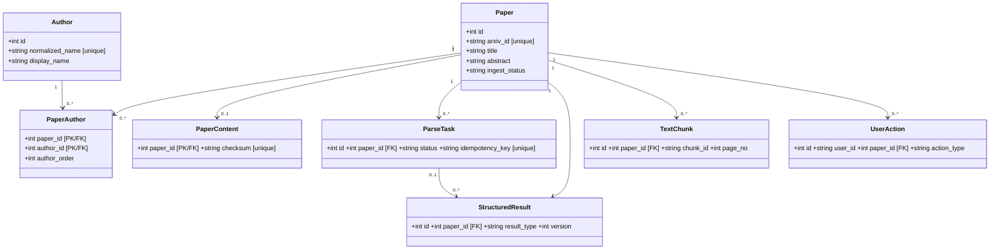
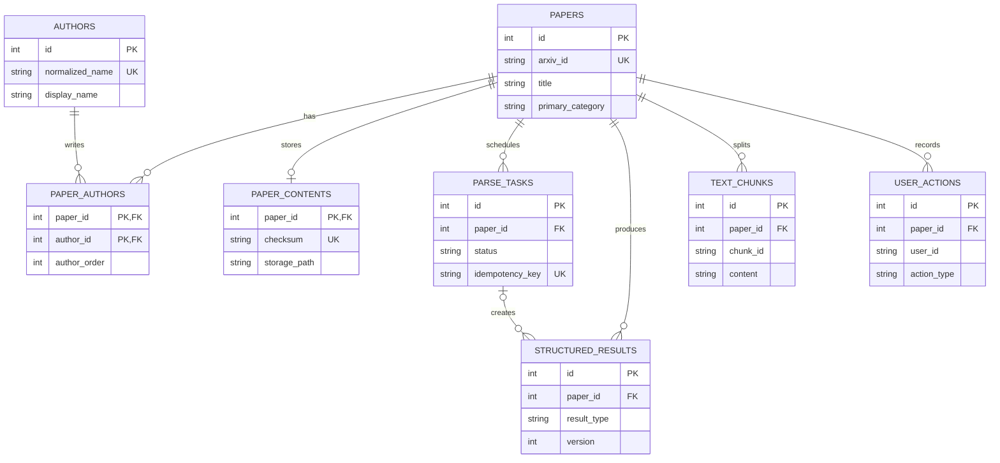
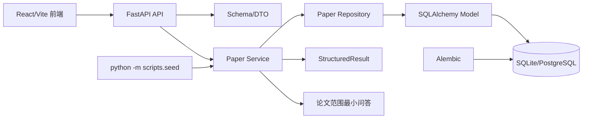
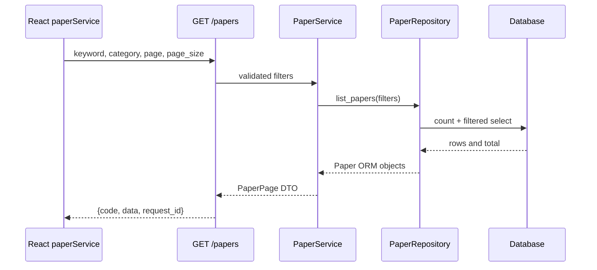

# PaperMate 后端数据库与联调基线

本文件记录当前可运行的后端最小闭环。数据库结构以 `backend/app/model/entities.py` 和 Alembic 迁移为准，接口字段以 FastAPI OpenAPI 为准。

## 领域分析类图



## ER 与约束



关键规则：`papers.arxiv_id`、`authors.normalized_name`、`parse_tasks.idempotency_key` 和结果版本组合唯一；`text_chunks` 只要求同一论文内 `chunk_id` 唯一；`user_actions` 不设置全表 `(user_id, paper_id)` 唯一约束。

## 后端组件图



## 检索时序



## 当前接口

| 方法 | 路径 | 用途 |
| --- | --- | --- |
| `GET` | `/health` | API 与数据库健康检查 |
| `GET` | `/api/papers` | 关键词、作者、分类、时间范围、分页检索 |
| `POST` | `/api/papers/batch` | 按 `arxiv_id` 批量幂等写入论文和作者 |
| `GET` | `/api/papers/{paper_id}` | 数字 ID 读取数据库论文；字符串 ID 兼容 Pipeline 样例 |
| `GET` | `/api/papers/{paper_id}/wiki` | 读取数据库结构化结果；未生成时回退论文摘要 |
| `POST` | `/api/papers/{paper_id}/qa` | 数据库论文或 Pipeline 样例的可追溯问答 |

成功响应统一为 `{code: "OK", message: "", data: ..., request_id: "..."}`。前端开发环境默认通过 `/api` 代理到 `http://127.0.0.1:8000`，设置 `VITE_USE_MOCK=true` 可切回原型 Mock。

## 本地启动

```bash
cd SE26Project-04/backend
source .venv/bin/activate
python -m alembic upgrade head
python -m scripts.seed
python -m uvicorn app.main:app --host 127.0.0.1 --port 8000
```
